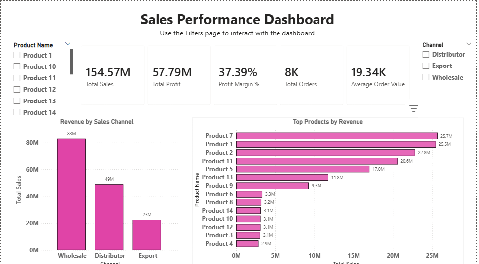
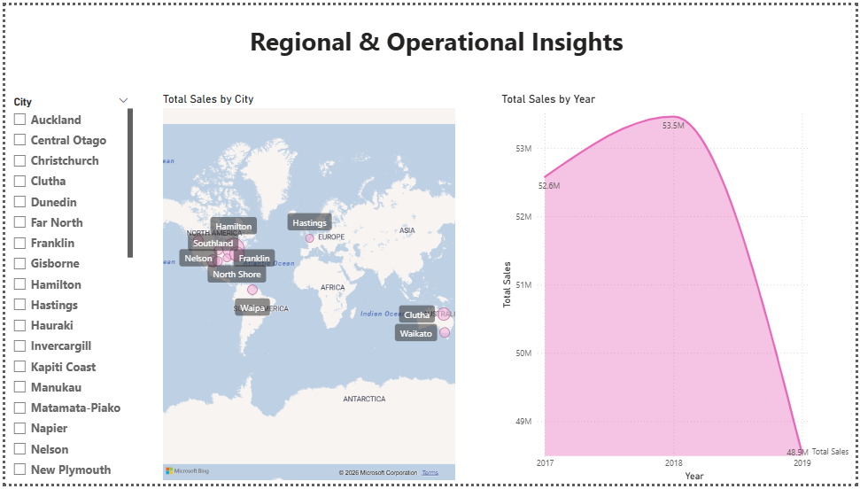
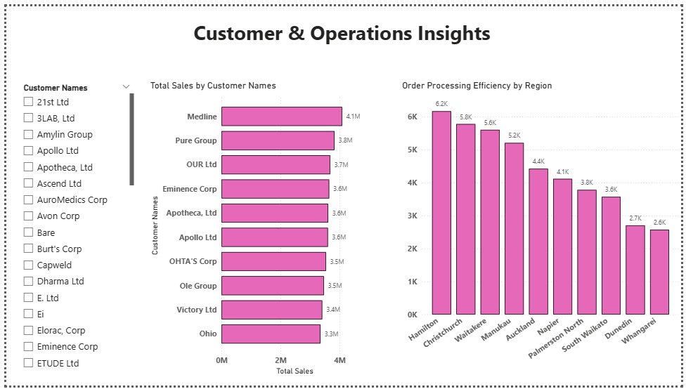

# sales-intelligence-powerbi-dashboard

This project presents an interactive Power BI dashboard designed to analyze sales performance across products, channels, regions, and customers.
The dashboard helps identify revenue drivers, high-performing products, and operational efficiency trends.

# Tools Used
Power BI
Power Query
DAX
Excel

# Dashboard Features

• KPI performance tracking
• Product sales analysis
• Sales channel performance
• Regional sales visualization
• Customer revenue insights
• Operational efficiency analysis
• Interactive filtering with slicers

## Project Overview

This project presents a Sales Intelligence Dashboard built in Power BI to analyze revenue performance, regional sales distribution, and customer-level insights.

The dashboard helps answer key business questions such as:
- Which sales channel generates the highest revenue?
- Which regions contribute most to total sales?
- Which customers drive the largest share of revenue?

  ## Dataset

The dataset contains transactional sales records including:

- Order Number
- Product Name
- Customer Name
- Sales Channel
- Order Quantity
- Order Processing Days
- Region / City

The dataset was cleaned and modeled inside Power BI.

## Key Insights

- Wholesale channel contributes the highest revenue (~83M).
- Top products generate over 25M in revenue individually.
- Profit margin across sales is approximately 37%.
- Hamilton and Christchurch show the highest operational order volume.

## Dashboard Preview

### Sales Performance Dashboard

### Regional & Operational Insights

### Customer & Operations Insights

